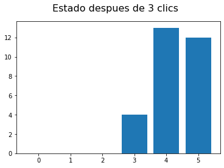

# DEMO SIMULADORES DE SISTEMAS CLASICOS

## 1. Sistema Clásico


La matriz de adyacencia asociada a este grafo es:

$$M = \begin{bmatrix} 0&0&0&0&0&0\\0&0&0&0&0&0\\0&1&0&0&0&1\\0&0&0&1&0&0\\0&0&1&0&0&0\\1&0&0&0&1&0\end{bmatrix}$$


```python
import matplotlib.pyplot as plt
import LibreriaMatricesComplejas as l
import math

def simulador(M,V,k):
    V_final = V[:]
    if k > 0:
        M_dinamica = potenciaMatriz(M,k)
        V_final = l.productoMatriz(M_dinamica,V)
    
    estado = []
    for i in range(len(V_final)):
        estado.append(V_final[i][0][0])
    index = list(range(len(estado)))
    plt.bar(index,estado)
    plt.suptitle('Estado despues de ' + str(k) + ' clics', fontsize=16)
    plt.show()

    
def simuladorCuantico(M,V,k):
    V_final = V[:]
    if k > 0:
        M_dinamica = potenciaMatriz(M,k)
        V_final = l.productoMatriz(M_dinamica,V)

    V_final = l.moduloCuadradoMatriz(V_final)
    estado = []
    for i in range(len(V_final)):
        estado.append(V_final[i][0])
    index = list(range(len(estado)))
    plt.bar(index,estado)
    plt.suptitle('Estado despues de ' + str(k) + ' clics', fontsize=16)
    plt.show()
    
def ensamblar(M,N):
    return l.productoTensorial(M,N)
    

def potenciaMatriz(M,n):
    answer = M
    for i in range(n-1):
        answer = l.productoMatriz(answer,M)
    return answer
```

Observaremos el estado despues de 0,1,2,3 clics usando el vector de estado inicial V:

$$V = \begin{bmatrix} 0\\0\\1\\0\\0\\0\end{bmatrix}$$


```python
M = [[(0,0),(0,0),(0,0),(0,0),(0,0),(0,0)],
     [(0,0),(0,0),(0,0),(0,0),(0,0),(0,0)],
     [(0,0),(1,0),(0,0),(0,0),(0,0),(1,0)],
     [(0,0),(0,0),(0,0),(1,0),(0,0),(0,0)],
     [(0,0),(0,0),(1,0),(0,0),(0,0),(0,0)],
     [(1,0),(0,0),(0,0),(0,0),(1,0),(0,0)]]

V = [[(0,0)],[(0,0)],[(1,0)],[(0,0)],[(0,0)],[(0,0)]]

simulador(M,V,0)
simulador(M,V,1)
simulador(M,V,2)
simulador(M,V,3)
```


Explicación de los estados

##  1.1 Juego De Las Canicas (Sistema Clásico)

Tenemos el vector:

$$V = \begin{bmatrix} 8\\2\\0\\4\\5\\10\end{bmatrix}$$

El juego consiste en que tenemos una cantidad de canicas y una cantidad de cajas, estas canicas estan ubicadas inicialmente en cada caja como nos indica el vector V. Estas canicas pueden cambiar de caja (posicion), como indica la matriz M previamente usada. Usando el sistema clasico podemos determinar la cantidad de canicas en cada posición después de una determinada cantidad de clics.


```python
M = [[(0,0),(0,0),(0,0),(0,0),(0,0),(0,0)],
     [(0,0),(0,0),(0,0),(0,0),(0,0),(0,0)],
     [(0,0),(1,0),(0,0),(0,0),(0,0),(1,0)],
     [(0,0),(0,0),(0,0),(1,0),(0,0),(0,0)],
     [(0,0),(0,0),(1,0),(0,0),(0,0),(0,0)],
     [(1,0),(0,0),(0,0),(0,0),(1,0),(0,0)]]

V = [[(8,0)],[(2,0)],[(0,0)],[(4,0)],[(5,0)],[(10,0)]]

simulador(M,V,0)
simulador(M,V,1)
simulador(M,V,2)
simulador(M,V,3)
```





## 2. Sistema Probabilistico


```python
M = [[(0,0),(0.61,0),(0.39,0)],
     [(0.5,0),(0.09,0),(0.41,0)],
     [(0.5,0),(0.3,0),(0.2,0)]]

V = [[(1,0)],[(0,0)],[(0,0)]]

simulador(M,V,0)
simulador(M,V,1)
simulador(M,V,2)
simulador(M,V,3)
```


## 2.1 Ensamble de sistemas probabilisticos

Tenemos dos sistemas probabilisticos, los cuales vamos a unir para tener un sistema mas complejo en el que tendremos la combinacion de todos los estados.


Las matrices de adyacencia asociadas a estos grafos las definiremos de la siguiente manera:

$$M = \begin{bmatrix} \frac{7}{34}&\frac{14}{34}&\frac{4}{34}&\frac{9}{34}\\\frac{15}{34}&\frac{6}{34}&\frac{12}{34}&\frac{1}{34}\\\frac{2}{34}&\frac{3}{34}&\frac{13}{34}&\frac{16}{34}\\\frac{10}{34}&\frac{11}{34}&\frac{5}{34}&\frac{8}{34}\end{bmatrix}$$

$$N = \begin{bmatrix} 0&0&0\\0&0&0\\0&0&0\end{bmatrix}$$


```python
M = [[(7/34,0),(14/34,0),(4/34,0),(9/34,0)],
     [(15/34,0),(6/34,0),(12/34,0),(1/34,0)],
     [(2/34,0),(3/34,0),(13/34,0),(16/34,0)],
     [(10/34,0),(11/34,0),(5/34,0),(8/34,0)]]

N = [[(0,0),(0.61,0),(0.39,0)],
     [(0.5,0),(0.09,0),(0.41,0)],
     [(0.5,0),(0.3,0),(0.2,0)]]

U = [[(0,0)],[(0,0)],[(0,0)],[(1,0)]]

V = [[(0,0)],[(1,0)],[(0,0)]]

A = ensamblar(M,N)

B = ensamblar(U,V)

simulador(A,B,0)
simulador(A,B,1)
simulador(A,B,2)
simulador(A,B,3)
```


## 3. Sistema Cuántico


     
La matriz de adyacencia asociada a este grafo es:

$$M = \begin{bmatrix} 0&\frac{1}{\sqrt{2}}&\frac{1}{\sqrt{2}}&0\\\frac{1}{\sqrt{2}}&0&0&\frac{-1}{\sqrt{2}}\\\frac{1}{\sqrt{2}}&0&0&\frac{1}{\sqrt{2}}\\0&\frac{-1}{\sqrt{2}}&\frac{1}{\sqrt{2}}&0\end{bmatrix}$$


```python
M = [[(0,0),(1/math.sqrt(2),0),(1/math.sqrt(2),0),(0,0)],
     [(1/math.sqrt(2),0),(0,0),(0,0),(-1/math.sqrt(2),0)],
     [(1/math.sqrt(2),0),(0,0),(0,0),(1/math.sqrt(2),0)],
     [(0,0),(-1/math.sqrt(2),0),(1/math.sqrt(2),0),(0,0)]]

U = [[(-1/math.sqrt(8),1/math.sqrt(8))],
     [(1/math.sqrt(8),-1/math.sqrt(8))],
     [(0,0)],
     [(0,1/math.sqrt(2))]
    ]

V = [[(0,0)],
     [(0,1)],
     [(0,0)],
     [(0,0)]
    ]

simuladorCuantico(M,V,0)
simuladorCuantico(M,V,1)
simuladorCuantico(M,V,2)
simuladorCuantico(M,V,3)
```


